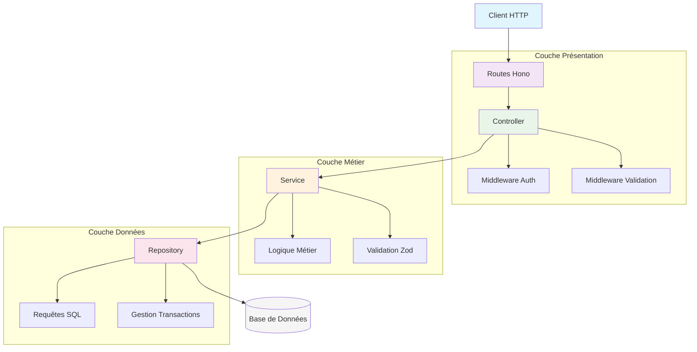

```mermaid
graph TB
    A[Client HTTP] --> B[Routes Hono]
    B --> C[Controller]
    C --> D[Service]
    D --> E[Repository]
    E --> F[(Base de Données)]

    C --> G[Middleware Auth]
    C --> H[Middleware Validation]

    D --> I[Logique Métier]
    D --> J[Validation Zod]

    E --> K[Requêtes SQL]
    E --> L[Gestion Transactions]

    style A fill:#e1f5fe
    style B fill:#f3e5f5
    style C fill:#e8f5e8
    style D fill:#fff3e0
    style E fill:#fce4ec
    style F fill:#f5f5f5

    subgraph "Couche Présentation"
        B
        C
        G
        H
    end

    subgraph "Couche Métier"
        D
        I
        J
    end

    subgraph "Couche Données"
        E
        K
        L
    end
```